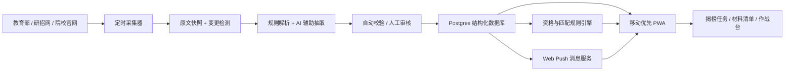

# 28 推免信息差 App：开源项目调研与实现方案

> 调研日期：2026-08-01  
> 当前阶段：仅做调研与方案，不编写 App 代码  
> 产品暂定名：**揭榜**（后续可改）

## 1. 先给结论

这个产品值得做，但不应只是“又一个招生通知列表”。最有价值的闭环应当是：

1. 从教育部、研招网、各高校研究生院和学院官网获取第一手信息；
2. 自动发现新增或变更，保留原文、时间和版本；
3. 把长篇通知拆成“硬门槛、时间、材料、流程、名额、原文链接”等结构化字段；
4. 根据用户档案给出可解释的资格判断和准备建议；
5. 通过“揭榜任务”通知用户，并把后续准备变成清晰的待办流程。

建议第一版采用 **移动优先 PWA**：用户用手机网址打开后可添加到主屏幕，像 App 一样使用；Android 和 iPhone 均可部署，后续可用 Capacitor 在复用同一套前端的基础上打包为 Android/iOS 原生 App。iPhone/iPad 的主屏幕 Web App 支持标准 Web Push，因此第一版无需先承担双端原生开发和应用商店上架成本。

## 2. GitHub 类似项目对比

维护状态和 Star 数为 2026-08-01 调研时的快照，只用于判断社区活跃度，不等同于产品质量。

| 项目 | 功能与架构 | 技术栈 | 优点 | 局限与风险 | 可借鉴内容 |
|---|---|---|---|---|---|
| [CS-BAOYAN/BoardCaster](https://github.com/CS-BAOYAN/BoardCaster) | 用 GitHub Issue 表单收集学校、学院、截止时间、官网链接、标签和面向年级；管理员关闭 Issue 后，GitHub Actions 调用脚本更新 JSON 数据库 | Python、JSON、CSV、GitHub Issues、GitHub Actions；MIT；50 Star；2026-07-24 有提交 | 数据结构清楚；提交门槛低；Issue 留下审核与修改痕迹；可供不同前端复用 | 主要依赖人工/社区报送，不是官网自动监测；缺少账号、个性化、资格计算和推送；数据质量依赖审核人 | **结构化数据层、人工复核队列、来源审计记录** |
| [CS-BAOYAN/CS-BAOYAN-DDL](https://github.com/CS-BAOYAN/CS-BAOYAN-DDL) | 从 BoardCaster 同步数据；提供院校等级、状态、省份、搜索、实时倒计时、列表/月历、详情侧栏、URL 状态同步、移动筛选抽屉；每 15 分钟同步数据，构建后部署到 GitHub Pages | Svelte 5、Vite 6、TypeScript、Tailwind CSS 4、GitHub Actions/Pages；MIT；451 Star；2026-07-24 有提交 | 手机端体验和信息密度很好；纯静态站快、便宜、可靠；筛选、倒计时、月历非常贴合保研场景 | 数据在构建时打包，无用户系统和服务端业务；不能做私人档案、材料管理、主动推送和规则计算；上游错误会直接传到前端 | **截止日视图、筛选、详情卡、低成本静态部署方式** |
| [shenyanpai/awesome-summer-camp-2026](https://github.com/shenyanpai/awesome-summer-camp-2026) | 按学校、学科大类和截止日期维护多份 Markdown 通知合集，覆盖理工、经管、文法、医农 | Markdown/GitHub；MIT；253 Star；2026-07-27 有提交 | 覆盖面广；访问和维护成本极低；适合快速建立院校来源清单；搜索引擎可见性好 | 同一信息在多份 README 中重复；结构化程度低；难以自动去重、判断变更和个性化；仍然依赖人工整理 | **初始院校清单、专业分类、内容运营方式** |
| [CS-BAOYAN/CSSummerCamp2024](https://github.com/CS-BAOYAN/CSSummerCamp2024) | 以单个大型 README 汇总计算机夏令营/冬令营通知，并连接预推免、导师招生和经验仓库 | Markdown/GitHub；GPL-3.0；1509 Star；2024-11 已归档 | 证明了社区共建式保研信息的真实需求；历史通知适合提取字段和建立往年样本 | 已归档，不适合作为新系统底座；只覆盖计算机；长 README 难维护；GPL 代码复用需要注意开源义务 | **历史数据字典、社区贡献机制、需求验证** |
| [WildHelper/MiniProgram](https://github.com/WildHelper/MiniProgram) | 高校教务微信小程序，前后端分离；支持成绩/考试查询、周期更新、出分推送、学校接口或爬虫接入、用户数据安全机制 | 原生微信小程序、TypeScript、REST API、配套 PHP 后端；AGPL-3.0；23 Star；最后提交 2020-07-27 | 展示了“校园数据自动获取 + 手机提醒 + 用户档案”的完整方向；重视加密、撤销授权、错误上报 | 技术和依赖较旧；强绑定学校教务系统；并非推免产品；AGPL 不适合直接复制到不准备同协议开源的产品 | **移动端通知、隐私最小化、前后端分离和运维告警** |

### 对比后的判断

最值得借鉴的是一套组合，而不是照搬某个仓库：

- 用 BoardCaster 的思路建立结构化数据和人工审核；
- 用 CS-BAOYAN-DDL 的思路做截止日期、筛选和手机信息密度；
- 用 awesome-summer-camp 的思路迅速建立院校覆盖清单；
- 用 WildHelper 的思路处理移动通知、用户数据和可撤销授权；
- 增加现有项目普遍缺失的 **官网变更监测、规则引擎、材料清单、用户匹配和版本追踪**。

## 3. 产品定位与边界

### 3.1 产品定位

“揭榜”是一个面向 2028 届推免生的第一手政策雷达和申请任务管理器，不是保研资讯搬运站，也不是用一句 AI 话术给出虚假录取概率的工具。

### 3.2 信息可信度分层

- **A 级：国家官方**——教育部、研招网推免服务系统等；
- **B 级：院校官方**——学校研究生院、招生网、教务处、学院官网；
- **C 级：官方补充渠道**——院校认证公众号等，仅作线索并要求回链官网；
- **D 级：社区线索**——GitHub、社群、经验帖，只进入待核验队列，不作为政策直接推送。

首页的“政策/招生简章”只发布 A/B 级信息。每条内容必须显示官方域名、原文链接、原文发布时间、系统抓取时间、最近核验时间和内容版本。

### 3.3 首批官方源

- [教育部研究生招生政策栏目](https://www.moe.gov.cn/srcsite/A15/moe_778/s3261/)
- [全国推免服务系统](https://yz.chsi.com.cn/tm/)
- 目标高校研究生院/招生网；
- 目标专业所在学院官网；
- 用户本科学校的教务处、学院推免细则页面。

## 4. 核心功能设计

### 4.1 今日揭榜

首页采用克制的“任务公告板”风格：

- 通知文案示例：`厦门大学发布 2028 年优秀大学生夏令营通知，请及时揭榜`；
- 卡片显示学校、学院、类型、截止倒计时、与你的匹配状态、官方来源；
- 操作只有“揭榜”“收藏”“不感兴趣”“查看官网”；
- 揭榜后自动生成材料待办和提醒节点；
- 完成阅读、核验条件、准备材料可增加“准备度”，但不做夸张游戏化或诱导签到。

### 4.2 政策雷达

- 每日新增、重要变更、临近截止三类消息；
- 同一通知发生修改时显示差异，例如“CET-6 门槛 425 → 450”“截止日期延长 3 天”；
- 支持学校、地区、学科、项目类型、院校层次、申请阶段、截止状态筛选；
- 列表、日历、时间线三种视图；
- 每条信息可一键直达官网，不用二次搜索。

### 4.3 要求与材料卡

将招生简章拆成可读字段：

- 基本资格：年级、是否需取得本校推免资格、专业背景；
- 学业门槛：排名、GPA、挂科/重修限制；
- 语言门槛：CET-4/CET-6/TOEFL/IELTS 的 OR 条件；
- 科研竞赛：论文、专利、竞赛、项目、作者/队员顺序；
- 材料：成绩单、排名证明、四六级、个人陈述、推荐信、证书、诚信承诺等；
- 流程：网申、邮件、纸质寄送、复试、系统确认；
- 时间：发布日期、报名开始、截止、材料寄达、活动日期、结果公示；
- 原文依据：对应页面或 PDF 页码/条款，低置信度字段标记“待人工核验”。

### 4.4 个人档案与资格判断

第一版建议收集：本科学校、专业、年级、专业排名/总人数、GPA、CET、科研、论文、专利、竞赛、处分/补考情况、意向地区与专业。默认不收身份证、详细住址等与判断无关的信息。

结果分三层：

1. **硬门槛判断**：符合 / 不符合 / 信息不足；
2. **匹配度 0–100%**：把学校背景、学业、语言、科研、专业相关性等做成透明权重，必须列出得分与扣分原因；
3. **录取概率**：只有积累了足量、可验证、具有代表性的往年申请结果后才启用。早期不能把匹配度伪装成“上岸概率”。正式启用时应展示概率区间、样本量、模型版本和可信度，而不是制造精确到个位数的假象。

这仍能满足“x%”的直观体验：MVP 显示“资格满足度 100% / 综合匹配度 72%”；有可靠历史数据后再显示“预计录取区间 25%–40%，低置信度”。

### 4.5 申请作战台

- 意向学校收藏夹；
- 冲刺 / 主申 / 保底分组；
- 每个项目的材料完成度、截止风险和下一步行动；
- 面试、邮件、报名系统、录取结果记录；
- 失败原因和结果可由用户自愿匿名回传，用于以后校准模型。

### 4.6 可扩展功能

- 政策变更周报与“本周最值得关注的 5 条”；
- 用户本校推免资格计算器；
- 院校横向对比；
- 材料模板中心；
- 个人时间线和日历导出；
- 社区纠错，但任何社区修改必须经过审核后才能进入官方信息层。

## 5. 本地 27 推免资料带来的设计要求

本地参考资料可以作为第一套规则引擎测试样本，但不能把 27 届规则直接当作 28 届政策。

从轮机工程学院 2027 届文件可以抽出：

- 普通路径包含专业前 30%、前六学期无补考/重修等硬条件；
- 外语存在 `CET-4 ≥ 480 OR CET-6 ≥ 400 OR 其他语言考试` 的组合条件；
- 综合成绩采用“学业成绩 80% + 全面发展测评 20%”的公式；
- 特殊学术专长路径可以放宽到专业前 50%、CET-4 ≥ 425，但同时增加论文/专利/竞赛、教授推荐、公示和答辩要求；
- 材料同时涉及申请表、诚信承诺、成绩单、排名、语言成绩、全面发展测评证明、电子版和纸质版；
- 2026 版与前版在处分认定、公示期等条款上出现变化。

因此规则系统必须支持：年份和学院版本、AND/OR 条件、例外路径、公式、证据材料、条款来源、有效期、变更对比和人工复核，不能用一组写死的 if/else 覆盖所有学校。

## 6. 推荐技术方案

### 6.1 客户端

- **React + Vite + TypeScript**：前端生态成熟，适合移动优先 Web App；
- **Tailwind CSS + 少量自建组件**：保持简洁，不堆重型 UI；
- **PWA + Service Worker + Web Push**：手机网址打开、添加到主屏幕、离线缓存、通知和角标；
- **Capacitor（后续）**：需要上架应用商店或使用更多原生能力时，把现有 Web App 包装为 Android/iOS App。

### 6.2 后端与数据

- **Supabase Postgres**：存结构化政策、用户、订阅、规则、材料与版本；
- **Supabase Auth + Row Level Security**：邮箱/第三方登录与用户数据隔离；
- **Supabase Storage**：保存网页/PDF 快照和用户可选上传的材料；
- **Edge Functions**：资格计算、消息分发、管理接口；
- **Cron**：定时调用同步任务并保留运行日志。

### 6.3 官网采集与解析

- **Python 采集器**：HTTPX、BeautifulSoup/Trafilatura；动态网页才使用 Playwright；PDF 使用 pypdf；
- **站点适配器**：每个官网登记列表页、详情页规则、时区、频率和允许路径；
- **快照与差异**：保存正文哈希和原始快照，只有新增/变化才进入解析；
- **结构化抽取**：规则解析优先，AI 仅作为复杂通知的辅助抽取器；输出必须符合 schema，并保存依据片段和置信度；
- **人工审核台**：新来源、低置信度字段、截止日期变化、资格条件变化必须审核后发布；
- **运行位置**：MVP 可用 GitHub Actions 定时运行；来源扩大或需要高频 Playwright 后迁移到独立 Python Worker。

### 6.4 推送

- 用户自行选择关注学校、地区、专业和消息频率；
- 即时推送只用于新简章、关键政策变化和紧急截止；
- 普通资讯汇总为每日一次摘要，避免通知轰炸；
- iOS 用户需先把 PWA 添加到主屏幕，并由用户主动点击开启通知；
- 推送必须提供退订和静默时段。

### 6.5 数据表建议

核心表包括：

- `sources`：官网来源与抓取策略；
- `source_snapshots`：原始内容、哈希、抓取时间；
- `universities`、`schools`、`programs`：学校/学院/项目；
- `notices`、`notice_versions`：通知及版本；
- `requirements`：条件树、门槛、公式和例外路径；
- `materials`、`deadlines`：材料与时间节点；
- `user_profiles`、`user_achievements`：个人档案；
- `eligibility_results`：计算结果、理由、规则版本；
- `favorites`、`application_tasks`：收藏和申请任务；
- `push_subscriptions`、`notifications`：推送订阅与发送记录；
- `review_tasks`：人工审核队列。

## 7. 系统架构

## 8. UI 风格

界面以白色、浅灰、深蓝/墨绿为主，只用琥珀色提示临期任务和红色提示硬性不符合。游戏感来自措辞、状态和进度，而不是复杂动画。

底部导航建议保持 4 项：

1. **揭榜**：今日任务和重要通知；
2. **院校**：筛选、搜索、日历；
3. **作战台**：收藏、材料、截止日；
4. **我的**：个人档案、资格结果、通知设置。

## 9. 实施阶段

### 阶段 0：产品和数据基线

- 确定首批学科与院校范围；
- 建立来源白名单和结构化 schema；
- 用本地 27 推免文件做第一套规则测试用例；
- 明确隐私政策、免责声明和人工审核流程。

### 阶段 1：可上线 MVP

- PWA 首页、院校列表、搜索筛选、详情和官方直达；
- 后台录入/审核；
- 20–50 个首批官方来源监测；
- 收藏、日历、截止倒计时；
- 首页“揭榜”任务卡。

### 阶段 2：个性化闭环

- 用户登录与个人档案；
- 条件树、资格判断和匹配度；
- 材料清单、作战台；
- Web Push、每日摘要、临期提醒；
- 规则版本和通知差异展示。

### 阶段 3：质量与扩展

- 扩展更多学科/院校；
- 匿名历史结果数据与概率模型；
- 监控、失败重试、数据质量报表；
- 需要时用 Capacitor 打包并上架 Android/iOS。

## 10. MVP 验收标准

- 手机浏览器可直接使用，并可添加到主屏幕；
- 每条政策都有可访问的官方原文和抓取/核验时间；
- 同一通知更新不会重复生成，而是产生可查看的新版本；
- 截止日期、硬门槛和材料字段可人工校验；
- 用户能清楚看到“为什么符合/不符合”，而不是只得到一个数字；
- 用户可订阅/退订通知并设置静默时段；
- 采集失败、解析失败和低置信度内容不会未经审核直接推送；
- 用户可导出或删除自己的个人数据。

## 11. 成本和运维判断

MVP 的前端、数据库和定时任务可以先使用托管平台的免费或低成本额度，主要可变成本来自自定义域名、AI 抽取调用和未来高频动态网页采集。真正长期的成本不是服务器，而是来源维护和信息审核，因此首版应先覆盖你最关心的 20–50 个官方来源，跑通质量闭环，再扩大到全国全部院校。

## 12. 开发前需要确认的默认选择

建议按以下默认值进入开发：

1. **终端形态**：先做 PWA，后续再用 Capacitor 打包原生 App；
2. **首批范围**：教育部/研招网 + 集美大学相关推免政策 + 你最关注的 20–50 所院校；
3. **评分表达**：MVP 显示资格满足度和综合匹配度，不伪造录取概率；积累数据后再上概率区间；
4. **账号方式**：先支持免登录浏览，只有收藏、档案、推送和作战台需要登录；
5. **产品风格**：简洁任务公告板，“揭榜”有氛围但不过度游戏化。

确认这些选择后再进入代码阶段。

## 参考链接

- [BoardCaster](https://github.com/CS-BAOYAN/BoardCaster)
- [CS-BAOYAN-DDL](https://github.com/CS-BAOYAN/CS-BAOYAN-DDL)
- [awesome-summer-camp-2026](https://github.com/shenyanpai/awesome-summer-camp-2026)
- [CSSummerCamp2024](https://github.com/CS-BAOYAN/CSSummerCamp2024)
- [WildHelper MiniProgram](https://github.com/WildHelper/MiniProgram)
- [WebKit：iOS/iPadOS 主屏幕 Web App 的 Web Push](https://webkit.org/blog/13878/web-push-for-web-apps-on-ios-and-ipados/)
- [Capacitor 官方文档](https://capacitorjs.com/docs)
- [Supabase：定时 Edge Functions](https://supabase.com/docs/guides/functions/schedule-functions)
- [研招网推免服务系统](https://yz.chsi.com.cn/tm/)
- [教育部研究生招生政策栏目](https://www.moe.gov.cn/srcsite/A15/moe_778/s3261/)
